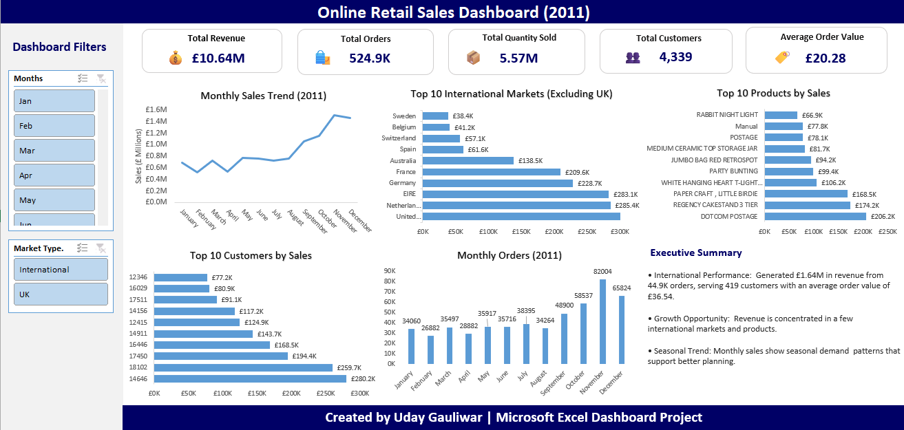

# 📊 Online Retail Sales Analysis Dashboard (Excel)

## Project Overview

This project is an end-to-end Excel dashboard built using the Online Retail dataset.

The objective was to clean raw retail transaction data, perform sales analysis, and build an interactive dashboard that provides meaningful business insights.

---

## Tools Used

- Microsoft Excel
- Pivot Tables
- Pivot Charts
- Slicers
- Excel Formulas
- Dashboard Design

---

## Dataset

The dataset contains:

- Invoice Number
- Product Description
- Quantity
- Unit Price
- Customer ID
- Country
- Invoice Date

---

## Data Cleaning

- Removed duplicate records
- Checked missing values
- Excluded cancelled transactions
- Removed invalid quantity values
- Created Sales column
- Created Month column
- Excluded UK sales to analyze international market performance

---

## Dashboard KPIs

- Total Revenue
- Total Orders
- Total Quantity Sold
- Total Customers
- Average Order Value

---

## Dashboard Features

- Monthly Sales Trend
- Monthly Orders Trend
- Top 10 Products by Sales
- Top 10 Customers by Sales
- Top 10 International Markets
- Interactive Filters (Slicers)

---

## Business Insights

- Generated over **£1.64M** in international revenue.
- Netherlands was the highest-performing international market.
- Sales peaked during October and November.
- Revenue is concentrated among a few customers and products.

---

## Dashboard Preview

---

## Author

**Uday Gauliwar**

Aspiring Data Analyst

Skills:
- Excel
- SQL
- Power BI
